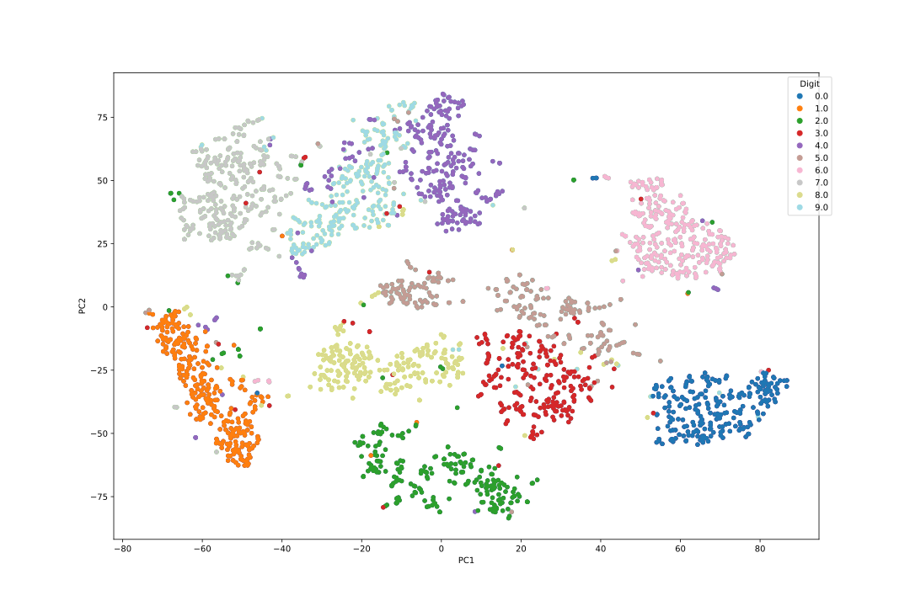

# Module1_Shiqiu

This module demonstrates dimensionality reduction on single-cell data using GraphDR and t-SNE.
Their original paper is here, for methods details please go there.
1. tSNE:
    Van der Maaten, Laurens, and Geoffrey Hinton. "Visualizing data using t-SNE." Journal of machine learning research 9.11 (2008).

2. GraphDR:
    Zhou J, Troyanskaya OG. An analytical framework for interpretable and generalizable single-cell data analysis. Nat Methods. 2021 Nov;18(11):1317-1321. doi: 10.1038/s41592-021-01286-1. Epub 2021 Nov 1. Erratum in: Nat Methods. 2022 Mar;19(3):370. doi: 10.1038/s41592-022-01421-6. PMID: 34725480; PMCID: PMC8959118.

## Features

- Provides tSNE and GraphDR methods for non-linear dimension reduction
- Command line interface for parameter controls
- Data preprocessing and PCA dimension reduction
- 2D and 3D plot generation

## Installation
### 1. Clone the Repository

<pre>
git clone https://github.com/UTSW-Software-Engineering-Course-2025/Module1_Shiqiu.git
cd Module1_Shiqiu
</pre>

### 2. Install python dependencies
<pre> pip install -r requirements.txt</pre>

## Usage
### Command line interface
<pre> python cli.py \
  --dataset sample_data \
  --dataset_name mnist_digit \
  --method tsne \
  --PCA True \
  --PCA_dimension 50 \
  --tsne_no_dims 2 \
  --tsne_perplexity 30.0 \
  --tsne_T 1000 \
  --normalize \
  --data_T
</pre>

### Python Example
<pre>from cookie.tsne import tsne
from cookie.GraphDR import graphdr, preprocess_data
import numpy as np

# Load and preprocess your data(optional)
data = np.loadtxt('path_to_your_data.txt')
data = preprocess_data(data) 

# Apply PCA if needed
from sklearn.decomposition import PCA
pca = PCA(n_components=50)
pca_data = pca.fit_transform(data)

# Apply t-SNE
tsne_results = tsne(pca_data, no_dims=2, perplexity=30.0, T=1000)

# Apply GraphDR
graphdr_results = graphdr(pca_data, lambda_=1.0, no_rotation=True, n_neighbor=10, top_d_eigenvector=10)
</pre>

### 2D t-SNE Plot

 ### 3D GraphDR Plot

[👉 View 3D GraphDR Plot](https://github.com/UTSW-Software-Engineering-Course-2025/Module1_Shiqiu/blob/dev/output/hochgerner/3dscatter_plot_PCA.html)
